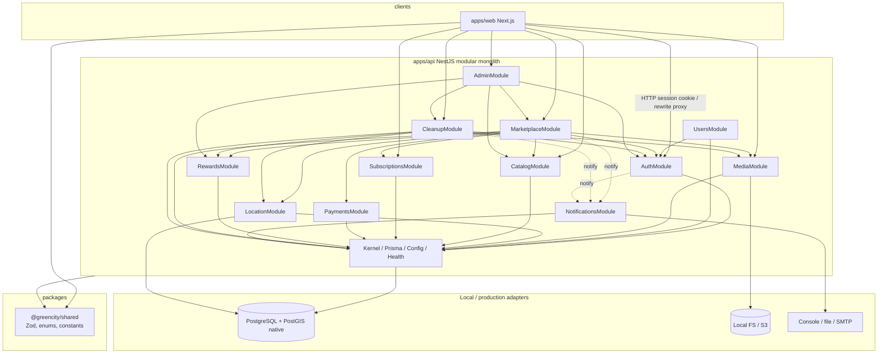
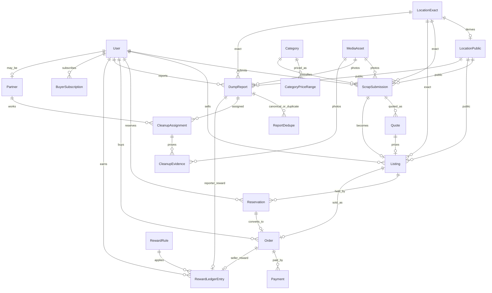

# GreenCity — Architecture

**Status:** Phase 0 scaffold active  
**Style:** Modular monolith, fewest moving parts  
**Local infra:** Native Windows PostgreSQL + PostGIS — **Docker not required**

---

## 1. Confirmed facts vs recommendations

| Kind | Statement |
|------|-----------|
| **Fact** | Phase 0 monorepo exists: `apps/api`, `apps/web`, `packages/shared`, Prisma User/Session |
| **Recommendation** | pnpm workspaces: `apps/web`, `apps/api`, `packages/shared` |
| **Recommendation** | NestJS feature modules for marketplace, cleanup, rewards, payments, media, auth (later phases) |
| **Recommendation** | Prisma + raw SQL for PostGIS |
| **Recommendation** | Cookie sessions (Postgres-backed); Next rewrite proxy for same-origin cookies |
| **Recommendation** | Object storage **port**: local FS (Phase 0) → S3-compatible (prod) |
| **Recommendation** | Mail **port**: console/file (Phase 0) → SMTP (prod) |
| **Local DB** | Native PostgreSQL + PostGIS (Windows). Docker optional for CI/deploy only |
| **Rejected** | Microservices, K8s, Redis/BullMQ on day 1, GraphQL, separate admin SPA, mandatory Docker for local dev |

---

## 2. Proposed monorepo layout

```text
GreenCity/
├── apps/
│   ├── web/                 # Next.js App Router + Tailwind
│   └── api/                 # NestJS modular monolith + Prisma
├── packages/
│   ├── shared/              # Zod schemas, enums, constants
│   └── tsconfig/
├── scripts/                 # Windows-native DB setup / PostGIS / verify
├── infra/
│   └── docker/              # OPTIONAL only (CI/deploy) — not required locally
├── docs/
├── package.json
├── pnpm-workspace.yaml
└── .env.example
```

### Workspace intent

```yaml
# pnpm-workspace.yaml
packages:
  - "apps/*"
  - "packages/*"
  - "e2e"
```

### What not to create day 1

| Skip | Why |
|------|-----|
| `packages/ui` | One web app — keep UI in `apps/web` |
| `packages/database` | Prisma lives in `apps/api` |
| Separate worker app | Nest in-process + schedule is enough initially |
| Turborepo | Add only when build graph hurts |
| OpenAPI codegen ceremony | Shared Zod contracts first |

---

## 3. NestJS module boundaries

### Modules

| Module | Responsibility | Owns (conceptually) |
|--------|----------------|---------------------|
| **Kernel** | Config, logging, health, Prisma | — |
| **Auth** | Register/login/logout, sessions, guards | User identity, Session |
| **Users** | Profile (non-auth) | display fields |
| **Media** | Presign, complete, asset metadata | MediaAsset |
| **Location** | Exact/public geo helpers, privacy | LocationExact, LocationPublic |
| **Catalog** | Categories, public price ranges | Category, CategoryPriceRange |
| **Marketplace** | Submission, quote, listing, reservation, weight, settlement | ScrapSubmission, Quote, Listing, Reservation, Order |
| **Subscriptions** | Buyer subscription windows | BuyerSubscription |
| **Payments** | Thin payment lifecycle + future provider adapter | Payment |
| **Cleanup** | Reports, dedupe, assignment, evidence, completion | DumpReport, Assignment, Evidence |
| **Rewards** | Rules + sole ledger writer | RewardRule, RewardLedgerEntry |
| **Notifications** | Transactional email (console/file local; SMTP later) | — |
| **Admin** | Thin controllers composing other modules | — |

### Dependency rules

```text
ALLOWED:
  Feature → Kernel / Prisma
  Feature → Auth (guards, current user)
  Marketplace → Catalog, Media, Location, Subscriptions, Payments, Rewards
  Cleanup → Media, Location, Rewards
  Payments → Kernel only (+ optional Events out)
  Rewards → Kernel only (called by Marketplace/Cleanup)
  Notifications ← called by Auth / Marketplace / Cleanup

FORBIDDEN:
  Rewards → Marketplace (use domain events / caller posts after settle)
  Media → Marketplace / Cleanup (Media is dumb storage)
  Auth → any feature module
  Cycles of any kind
  Frontend setting entity status fields
```

### Layering inside a feature (keep flat when small)

```text
controllers/     HTTP, map DTO ↔ use-case
application/     command handlers / services
domain/          pure state machines, invariants
infra/           Prisma repos, adapters
```

---

## 4. Module dependency diagram



---

## 5. Frontend architecture (high level)

| Area | Approach |
|------|----------|
| Routes | App Router: public catalog/map, seller flows, buyer flows, reporter flows, `/admin` |
| Data | Fetch Nest API; no business status writes from client forms as free-form status |
| Forms | Shared Zod from `@greencity/shared` + react-hook-form |
| Auth | Cookie session via same-origin proxy (`/api/*` → Nest) preferred |
| UI | Tailwind + shadcn/ui; responsive mobile-first |
| Admin | Same Next app, role-gated |

---

## 6. Infrastructure choices

### Auth

| Piece | Choice |
|-------|--------|
| Transport | HTTP-only Secure cookie |
| Store | Postgres `Session` (Redis later if needed) |
| Password | argon2id (or bcrypt if ops prefer) |
| Roles | `user`, `admin`, `cleanup_partner` (+ buyer capability via subscription) |

### Uploads / object storage

**Phase 0:** `STORAGE_DRIVER=local` → filesystem under `.local/storage` via `ObjectStorage` port.  
**Later:** `STORAGE_DRIVER=s3` → S3-compatible adapter (interface already stubbed).

Paths resolve from **monorepo root** (via `pnpm-workspace.yaml` discovery), so starting from repo root or `apps/api` yields the same storage root.

Local driver rejects `..` traversal, absolute paths, and symlink/junction ancestors.
**Residual TOCTOU:** a directory could be swapped for a junction between containment checks and write; Phase 0 accepts this for single-trust-dev hosts; upgrade if untrusted multi-tenant writers share the FS.

### Health / readiness

`GET /health` is a **readiness** endpoint only (not liveness):

| Condition | HTTP | Body status |
|-----------|------|-------------|
| DB + PostGIS up | 200 | `ok` |
| DB and/or PostGIS down | 503 | `error` with checks down |
| Invalid env | process exits at startup | n/a |

The process **stays up** when the database is unreachable so readiness can return 503.

### Mail

**Phase 0:** `MAIL_DRIVER=console` (or `file`).  
**Later:** `MAIL_DRIVER=smtp` (interface stubbed). No MailHog required.

### Jobs (MVP)

- No dedicated worker.
- Nest schedule for reservation/quote TTL expiry if policies require it.
- Email fire-and-forget with console/file logging; SMTP when configured.

### Database

| Piece | Choice |
|-------|--------|
| Engine | PostgreSQL 16 + PostGIS (**native local**; Docker optional) |
| ORM | Prisma migrations + models |
| Geo | `Unsupported("geometry(Point,4326)")` + raw SQL `ST_*` |
| Money | Integer VND |
| Setup scripts | `pnpm db:setup`, `db:postgis`, `db:migrate`, `db:verify` |

### Optional Docker (CI/deploy only)

`infra/docker/` may host a compose file for teams that want containers. **It is not required for local development** on the project owner’s machine.

No Redis/Kafka/Elasticsearch for MVP.

---

## 7. Initial ERD (core)



### Critical constraints (DB)

```sql
-- one live commercial claim per listing
CREATE UNIQUE INDEX uq_orders_one_live_per_listing
  ON orders (listing_id)
  WHERE status NOT IN ('cancelled', 'failed');

-- one accepted reservation per listing
CREATE UNIQUE INDEX uq_reservations_one_accepted_per_listing
  ON reservations (listing_id)
  WHERE status = 'accepted';

-- one successful payment per order
CREATE UNIQUE INDEX uq_payments_one_success_per_order
  ON payments (order_id)
  WHERE status = 'succeeded';

-- one open cleanup assignment per report
CREATE UNIQUE INDEX uq_assignments_one_open_per_report
  ON cleanup_assignments (report_id)
  WHERE status IN ('assigned', 'in_progress', 'submitted');

-- reward idempotency
CREATE UNIQUE INDEX uq_reward_ledger_idempotency
  ON reward_ledger_entries (idempotency_key);
```

### Location privacy

| Audience | Location precision |
|----------|-------------------|
| Public / browsing buyer | `LocationPublic` only (grid/jitter + district) |
| Authorized party after gate | `LocationExact` (accepted reservation/paid per policy; assigned partner; admin) |
| Admin | Full, audited |

### Reward ledger

- **Only INSERT** for amounts; reversals are new debit rows.
- Balance = `SUM(credit) - SUM(debit)` per user.
- **Forbidden:** mutable `users.balance` as source of truth.

### Concurrency for reserve/order

In one transaction:

1. `SELECT listing FOR UPDATE`
2. Assert status allows claim
3. Insert reservation/order
4. Update listing status
5. Commit  

Partial unique indexes are the backstop; map unique violations to `409`.

---

## 8. Shared package strategy

| Package | Contents |
|---------|----------|
| `@greencity/shared` | Zod request/response schemas, enums (`ListingStatus`, …), constants (`SUBSCRIPTION_PRICE_VND = 50000`) |
| Not in shared | Prisma client, Nest decorators, React components, secrets |

API validates with same schemas as web forms → fewer client/server drift bugs.

---

## 9. What NOT to build in MVP

| Reject | Why |
|--------|-----|
| Microservices / message bus | Explicit product constraint |
| Kubernetes | Compose + simple deploy later |
| Blockchain / wallets | Out of scope |
| AI vision | Human review |
| Realtime chat | Status + email |
| Bidding | Fixed price only |
| Payment integration before stable domain | Mandatory sequencing |
| Thumbnail pipelines, Elasticsearch | YAGNI |
| Full double-entry GL | Simple VND ledger enough |

---

## 10. Suggested build order (scaffolding → features)

Documented fully in [implementation-roadmap.md](./implementation-roadmap.md). Architecture-level sequence:

1. Repo + Compose + Prisma skeleton + Auth  
2. Catalog price ranges + Media + Location privacy helpers  
3. Marketplace submission → quote → list (no pay)  
4. Subscriptions + reserve concurrency  
5. Weight confirm + payment adapter **after** machines stable  
6. Settlement + seller rewards  
7. Cleanup full path + reporter rewards  
8. Playwright critical paths  

---

## 11. Open architecture decisions

1. Next proxy vs cross-origin cookies  
2. Phone OTP vs email/password first  
3. When to introduce BullMQ (only after email/webhook reliability pain)  
4. RLS in Postgres vs app-only authz for v1 (recommend app-only)  
5. Payment provider adapter interface shape once provider is chosen  
