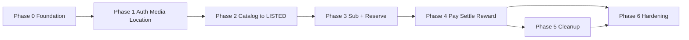

# GreenCity — Implementation Roadmap

**Status:** Phase 0 scaffold landed (see acceptance notes in project-context).  
**Repo state:** pnpm monorepo with Nest API, Next web, Prisma User/Session, Docker Compose files.

---

## 0. How to read this plan

- Phases are **sequential** unless noted parallel-safe.
- Each phase has **dependencies**, **scope**, and **acceptance criteria**.
- Vertical slices preferred inside phases (thin end-to-end paths).
- **Payment provider integration is blocked** until domain model + state machines are stable (end of Phase 3) and a provider is selected with real documentation.
- No fake test results: acceptance means commands actually pass when that phase is implemented.

### Document baseline (this planning pass)

| Deliverable | Path |
|-------------|------|
| Project context | `docs/project-context.md` |
| Domain model | `docs/domain-model.md` |
| State machines | `docs/state-machines.md` |
| Architecture | `docs/architecture.md` |
| Security risks | `docs/security-risks.md` |
| Testing strategy | `docs/testing-strategy.md` |
| This roadmap | `docs/implementation-roadmap.md` |

---

## Phase 0 — Repository foundation

**Goal:** A runnable empty modular monolith skeleton.

**Dependencies:** None (greenfield).

### Work

1. Initialize git repository and `.gitignore`.
2. pnpm workspaces: `apps/web`, `apps/api`, `packages/shared`.
3. NestJS API hello + health; Next.js App Router shell.
4. Docker Compose: PostGIS, MinIO, MailHog.
5. Prisma init + first migration (User/Session minimal).
6. Shared Zod health/error shapes; root scripts: `lint`, `typecheck`, `test`, `build`.
7. `.env.example`; README with install/dev commands.
8. CI skeleton (lint + typecheck + unit placeholder).

### Acceptance criteria

- [x] `pnpm install` succeeds.
- [x] `pnpm lint` and `pnpm typecheck` succeed.
- [x] `pnpm --filter api build` and `pnpm --filter web build` succeed.
- [ ] `docker compose up` starts PostGIS + MinIO (+ MailHog). *(Compose files present; Docker CLI not installed on implementer machine — use Compose when Docker is available. Native Postgres 16 used for DB verification.)*
- [x] API `/health` returns OK including DB ping (`database: "up"`).
- [x] Web loads a placeholder page.
- [x] Git history exists; README documents commands.

### Exit checkpoint

Greenfield → **scaffold exists**; still no domain features. **Phase 1 not started.**

---

## Phase 1 — Identity, RBAC, media, location privacy primitives

**Goal:** Secure base for all later features.

**Dependencies:** Phase 0.

### Work

1. Register/login/logout; Postgres sessions; HttpOnly cookies; password hashing.
2. Roles: `user`, `admin`, `cleanup_partner`; **never** client-settable.
3. Authz helpers + deny-by-default; audit log table for privileged actions.
4. MediaModule: presign → upload → complete; private MinIO; image allowlist.
5. LocationExact / LocationPublic model + snap/jitter helper; DTO redaction utilities.
6. Unit tests for redaction and authz matrix (table-driven).

### Acceptance criteria

- [ ] Unauthenticated users cannot access protected routes.
- [ ] Role elevation via API body fails.
- [ ] Media objects private; GET only via authorized signed URL path.
- [ ] Public DTO helpers never emit exact coordinates.
- [ ] Unit tests for authz + geo redaction pass.
- [ ] Lint/typecheck/build still pass.

### Exit checkpoint

Can create users/sessions/media/locations without domain commerce.

---

## Phase 2 — Catalog + marketplace to LISTED (no payment)

**Goal:** Scrap submission → admin quote → seller accept → public listing.

**Dependencies:** Phase 1; domain docs stable for marketplace pre-pay states.

### Work

1. Category + public min/max unit price configuration (admin).
2. `SubmitScrap` with photos, category, estimate, location.
3. Admin review: reject or `IssueQuote` with price **in range** + range snapshot.
4. Seller `AcceptQuote` / `RejectQuote` → `LISTED` or terminal.
5. Public listing browse (coarse location only).
6. State machine unit tests + integration for quote range and transitions.
7. Admin UI + seller UI thin vertical slice.

### Acceptance criteria

- [ ] Quote outside category range rejected.
- [ ] Client cannot PATCH listing/submission status to `LISTED`.
- [ ] Public listing APIs omit exact address/coords.
- [ ] Seller accept creates exactly one listing per submission.
- [ ] Integration I1 (status), I9 (range), I8 (location public) pass for this slice.
- [ ] Lint/typecheck/build pass.

### Exit checkpoint

Catalog live for browsing; **no reserve/pay yet**.

---

## Phase 3 — Subscriptions + reservation concurrency (still no PSP)

**Goal:** Buyer gate + single-winner reserve without real payment provider.

**Dependencies:** Phase 2.

### Work

1. `BuyerSubscription` model; admin/test hook or mock “activate subscription” for dev only (clearly marked).
2. `ReserveListing` requires active subscription.
3. Reservation hold + listing `LISTED → RESERVED`.
4. Partial unique indexes + `SELECT … FOR UPDATE` transaction.
5. Release/expire reservation (TTL policy if decided; else admin release).
6. Concurrency tests C1; integration I2, I4.
7. Buyer UI: reserve blocked without sub; success with sub.

### Acceptance criteria

- [ ] Unsubscribed/expired buyer cannot reserve (I4).
- [ ] Two concurrent reserves/accepts → exactly one winner (C1).
- [ ] DB unique constraint exists and is proven by test.
- [ ] No payment provider code required yet (mock subscription activation documented as temporary).
- [ ] Lint/typecheck/build pass.

### Exit checkpoint

Domain model + marketplace machines through **RESERVED** proven.  
**Payment integration may start only after this checkpoint and open Q20 provider choice.**

---

## Phase 4 — Weight confirm, orders, payment adapter, settlement, seller reward

**Goal:** Commercial close for marketplace.

**Dependencies:** Phase 3; **provider selected with official docs**; state machines frozen for payment/settlement.

### Work

1. `ConfirmActualWeight` → lock invoice `amount = unit_price × confirmed_weight`.
2. Order aggregate + payment states (`CREATED → PENDING → SUCCEEDED|FAILED|EXPIRED`).
3. Provider adapter: create checkout, verify webhook signature, idempotent success.
4. Subscription **real** checkout for 50,000 VND/month (same adapter).
5. `CompleteSettlement` → `SETTLED`.
6. RewardsModule: deterministic seller reward 2,000–5,000; append-only ledger; idempotency.
7. Integration I3, I5, I6, I10; concurrency C2, C4; E2E E1, F1, F5.
8. Remove or lock down any dev-only “force activate subscription” path.

### Acceptance criteria

- [ ] Final amount ignores client-supplied totals; matches formula.
- [ ] Payment success only via verified webhook path (not return URL alone).
- [ ] Webhook retries do not double-pay or double-reward.
- [ ] Seller reward once per settled order; ledger-only balance.
- [ ] No `users.balance` source of truth.
- [ ] Subscription advances only on verified payment.
- [ ] Required tests green; lint/typecheck/build pass.

### Exit checkpoint

Marketplace money path operational under chosen provider.

---

## Phase 5 — Cleanup contribution (Đóng góp)

**Goal:** Report → verify/dedupe → assign → evidence → complete → reporter reward.

**Dependencies:** Phase 1 (can start UI shell after Phase 1); **reward ledger from Phase 4** (or extract RewardsModule earlier if Phase 4 slips — ledger must exist before rewards).  
**Recommended:** after Phase 4 so RewardsModule is production-shaped; alternatively implement ledger in Phase 4a shared before seller reward.

### Work

1. `SubmitReport` with media, waste type, GPS, address (exact + public).
2. Admin verify / reject / mark duplicate (geo proximity helper).
3. Assign cleanup partner; partner evidence before/after.
4. Admin `VerifyCleanupCompletion` only path to `COMPLETED`.
5. Reporter reward 2,000–10,000 via rules + ledger.
6. Integration I7; E2E E3, F7; privacy I8 for dump locations.

### Acceptance criteria

- [ ] Partner cannot mark report completed/rewarded.
- [ ] Duplicate policy prevents double full rewards per product rule.
- [ ] Reward only after admin `COMPLETED`; once per canonical report.
- [ ] Unauthorized actors do not receive exact dump coordinates.
- [ ] Tests for cleanup matrix green; lint/typecheck/build pass.

### Exit checkpoint

Both business domains deliver core happy paths.

---

## Phase 6 — Hardening, observability, launch readiness

**Goal:** Production hygiene without scope creep.

**Dependencies:** Phases 4–5.

### Work

1. Rate limits (auth, OTP if any, uploads, geo queries).
2. Structured logging with PII redaction; request ids; basic metrics.
3. Admin MFA; force-transition reason codes.
4. Privacy notice / consent copy hooks (legal content TBD).
5. Full Playwright suite on CI main; concurrency in CI.
6. Backup/restore notes for Postgres; secret management checklist.
7. Resolve remaining open questions that block launch (payouts, KYC, retention).

### Acceptance criteria

- [ ] Smoke + full E2E on main pipeline.
- [ ] P0 security risks from `security-risks.md` have implemented mitigations or accepted residual risk documented.
- [ ] Runbook: deploy, migrate, rollback, webhook replay.
- [ ] No known double-sell or double-reward defects open.

---

## Dependency graph (phases)

**Note:** Cleanup (P5) logically needs Rewards + Media + Auth. If schedule pressure requires earlier cleanup without payments, implement **Rewards ledger + rules first** as a thin Phase 3.5, then run cleanup parallel to payment **only after** ledger exists — still no double-writing shared files across agents.

---

## Cross-cutting work rules

| Rule | Application |
|------|-------------|
| Frontend never owns status | Every phase with workflows |
| No double accepted reservation | Phase 3+ constraints |
| No balance column SoT | Phase 4+ rewards |
| No exact address pre-authz | Phase 2+ APIs |
| No payment until machines stable | Hard gate before Phase 4 |
| No invented PSP features | Phase 4 adapter review |
| Tests before merge on domain PRs | Per `testing-strategy.md` |

---

## Explicit non-goals until post-MVP

- Microservices, Kubernetes, blockchain, AI image recognition, realtime chat
- Bidding
- Complex logistics fleet management
- Full cash-out banking product (ledger credit may ship before cash-out)
- Multi-tenant white-label

---

## Unresolved questions that block or shape phases

| ID | Blocks | Question |
|----|--------|----------|
| Q1 | Phase 4 details | Who confirms actual weight? |
| Q2 | Phase 4 states | Logistics / pickup model |
| Q5 | Phase 4 payouts | Seller commercial proceeds vs reward-only |
| Q6 | Phase 3–4 | Subscription grace / mid-reservation expiry |
| Q9 | Phase 4–5 | Reward rule input factors |
| Q10 | Phase 6 | Reward cash-out channel |
| Q11 | Phase 5 | Duplicate report reward policy |
| Q19 | Phase 3 | Self-dealing allowed? |
| Q20 | **Phase 4 start** | Payment provider choice + real docs |

---

## Immediate next step after plan approval

1. Human review of `docs/*` and open questions.  
2. Resolve Q20 (provider) timeline vs Phase 4.  
3. Execute **Phase 0** only — scaffold monorepo; no marketplace features yet.

**Stop line for this task:** Planning deliverables complete. Phase 0+ implementation not started.
