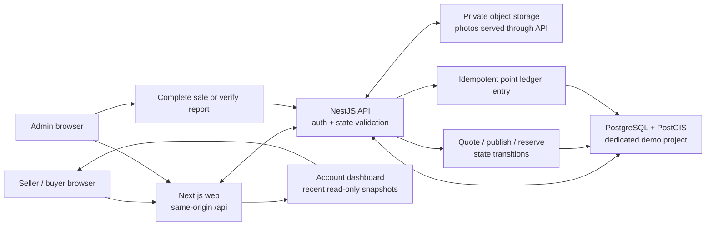

# GreenCity — startup contest presentation

Use **CURRENT**, **DEMO** and **ROADMAP** exactly as shown below. Do not add
user, revenue, impact, partner or payment metrics that are not evidenced.

## 5-minute story: 8 slides

| # | Time | Slide | What to show and say |
| --- | --- | --- | --- |
| 1 | 0:00 | The broken loop | Scrap sellers, buyers and community reports live in disconnected flows. GreenCity demonstrates one traceable loop; no traction claim. |
| 2 | 0:30 | CURRENT product loop | Seller submits → admin quotes/publishes → eligible buyer reserves → admin completes → seller receives ledgered points. A verified cleanup report is the other point source. |
| 3 | 1:05 | Live walkthrough | Show one seeded marketplace listing, reserve it as `buyer@`, then complete it through the admin route. State that the demo DB is dedicated, not production. |
| 4 | 1:50 | Account as evidence | Show seller points + recent sale, then buyer reservation + cleanup report. Point to Buyer Pass/payment-history sections without calling a demo pass a payment. |
| 5 | 2:35 | Architecture and trust boundary | Explain same-origin API, authenticated server-side state transitions and ledger-only reward grants. |
| 6 | 3:20 | Product honesty | Rewards catalog is **DEMO-only**: no cash, no real coupon, EVN/water payment, affiliation or redemption. |
| 7 | 3:55 | Evidence and roadmap | Separate code-backed CURRENT flows from demo catalog and unverified real-payment/partner work. |
| 8 | 4:30 | Ask and Q&A | Ask judges to evaluate the traceable loop and operating discipline, not invented adoption. Use the answers below. |

## Architecture and data flow



The database used in a contest reset must be a dedicated demo project. The
operational preflight lives in [`demo-runbook.md`](demo-runbook.md); never reset
a shared or production project for a presentation.

## Evidence matrix

| Capability | Status | Safe evidence | Honest wording |
| --- | --- | --- | --- |
| Email/password session, seller request, admin quote/publish | **CURRENT** | Routes and admin queue | A working vertical slice; price/collection outcome is not a payout promise. |
| One-buyer reservation and admin completion | **CURRENT** | Marketplace plus transaction queue | One listing has one successful reservation; completion is an admin decision. |
| Points after completed sale or verified cleanup report | **CURRENT** | Account balance and ledger | Points are internal, event-traceable rewards; no cash value. |
| Account dashboard for points, sales, reservations, pass/payment history and cleanup | **CURRENT** | Signed-in, dedicated-demo account | Read-only recent snapshots; an empty payment history is valid evidence when no payment occurred. |
| Coupon, EVN and water catalog | **DEMO-ONLY** | Badge and `DEMO-ONLY` preview | No redemption, deduction, payment or affiliation is live. |
| Seeded Buyer Pass | **DEMO-ONLY** | Eligibility status | The seed creates eligibility without processing money. |
| Real payOS checkout and signed merchant webhook | **ROADMAP** | Do not demo as paid | Integration remains unverified against a real merchant account. |
| Partner redemption / public-service settlement | **ROADMAP** | Do not claim partner access | Requires agreements and provider integration; no confirmed date. |

## Judge Q&A

- **Is this a payment or loyalty wallet?** No. Points cannot be withdrawn,
  traded or transferred; they are internal ledger entries.
- **Can a coupon, EVN or water offer be used now?** No. It is a contest demo
  preview only, with no redemption, payment or current affiliation.
- **How do you stop point farming?** The system grants points only after admin
  completion/verification and protects each source event from duplicate grants.
- **Is Buyer Pass revenue already proven?** No. Price and eligibility exist as
  a product hypothesis; real merchant checkout has not been verified.
- **Why show an empty payment section?** It is more honest than fabricating a
  transaction. The dashboard is designed to show a recorded status when one
  exists.
- **What comes next?** Validate field collection operations, signed partner
  agreements and a real payment/webhook round trip before making claims.

## Screenshot capture checklist

- [ ] Label the source: **LIVE dedicated-demo data**, **MOCKED E2E fixture**,
  or **public foundation screenshot**. Never present a mocked screenshot as a
  live transaction.
- [ ] For Account, sign in only to the dedicated demo deployment; crop or mask
  unnecessary email, phone, IDs and payment references.
- [ ] Do not add an Account screenshot to `apps/web/screenshots/` until a
  deterministic auth fixture and reviewed Playwright test exist. The current
  committed screenshot set is public/foundation evidence only.
- [ ] To regenerate that existing set, install Chromium once and run exactly:

  ```powershell
  corepack pnpm --filter web exec playwright install chromium
  corepack pnpm --filter web test:e2e -- --grep "Approved screenshot set"
  ```

- [ ] Prerequisites for that command: workspace dependencies installed,
  Chromium installed, a test-ready local API/database and the production build
  invoked by `pretest:e2e`. It does not create an authenticated Account capture.

See [`demo-runbook.md`](demo-runbook.md) for the dedicated-project confirmation
and manual live-data capture constraints.
