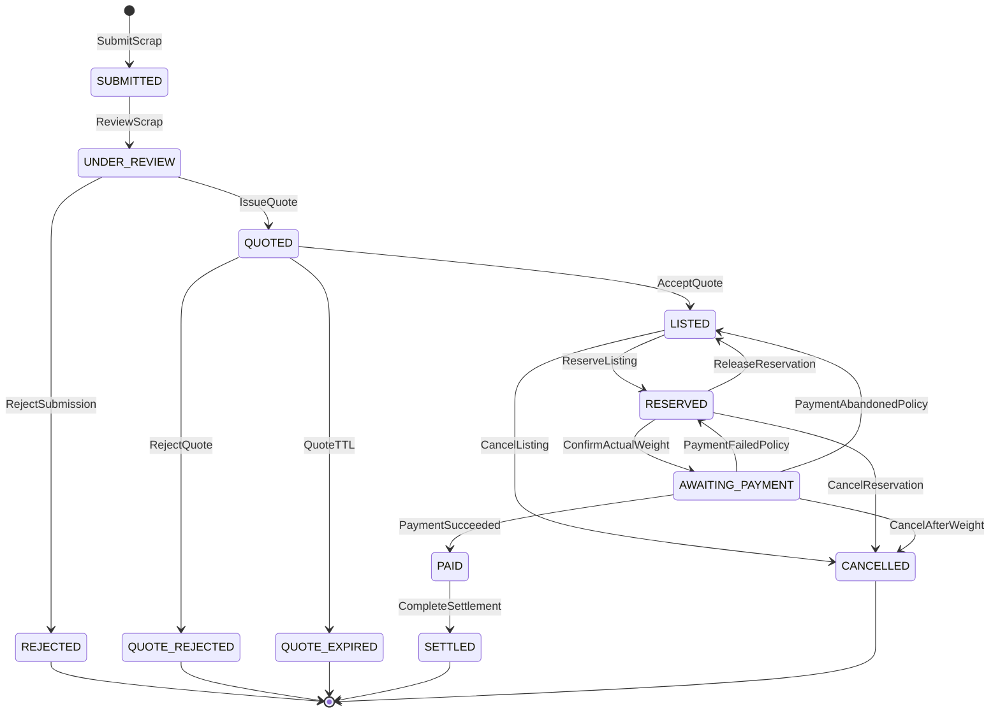
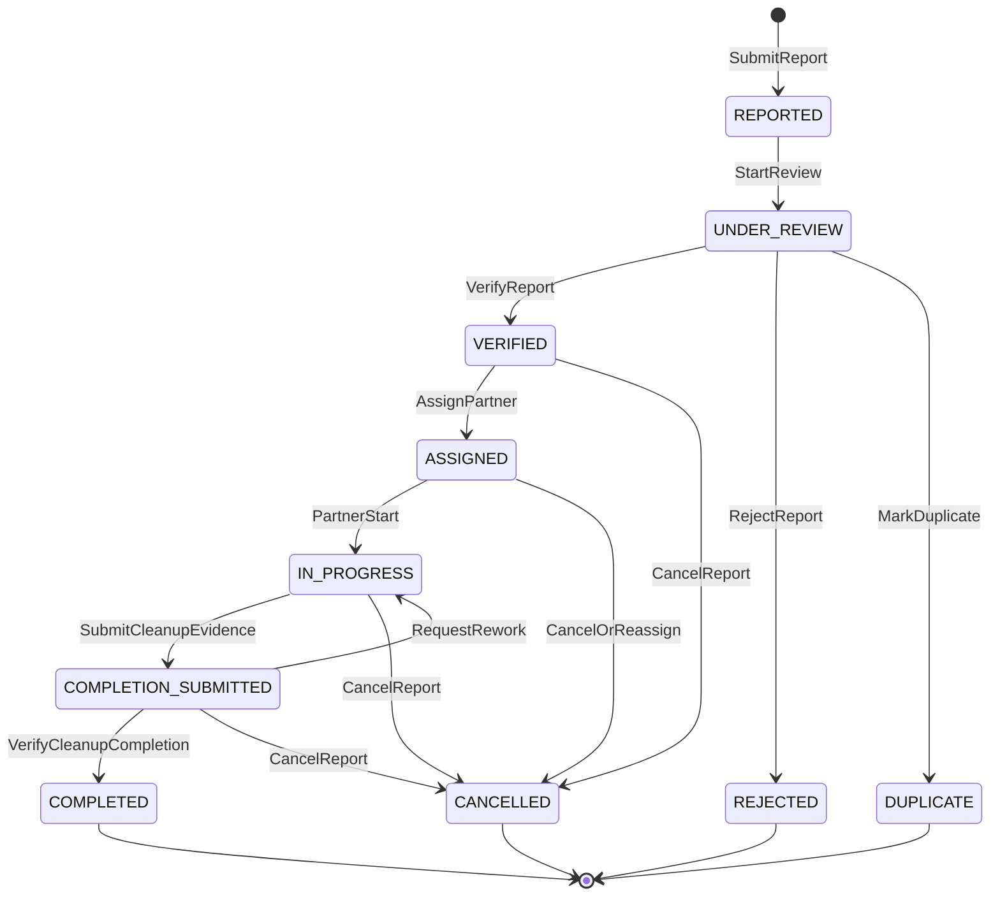
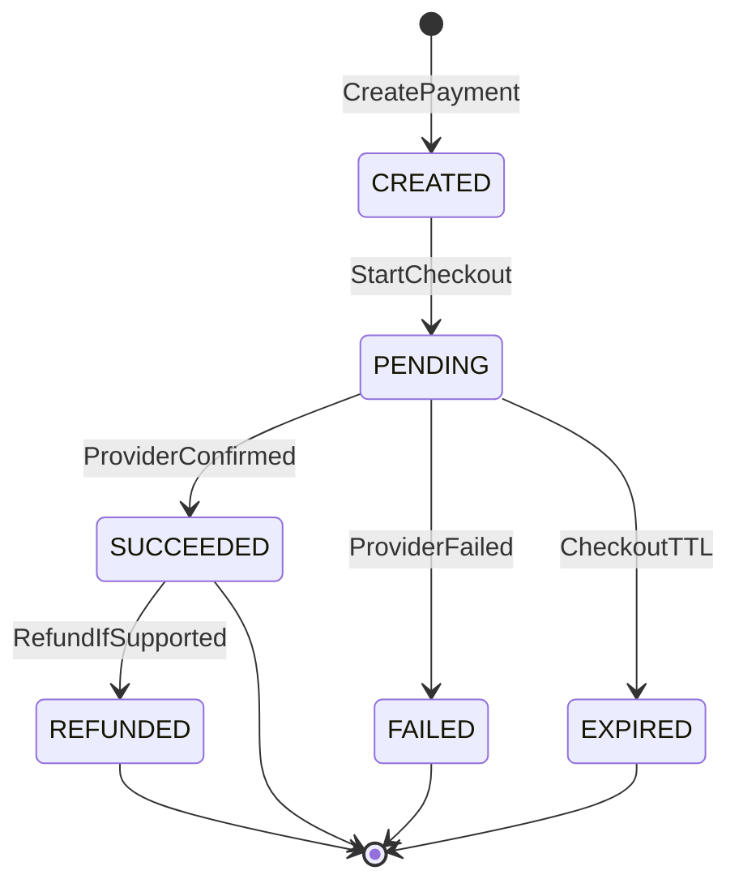
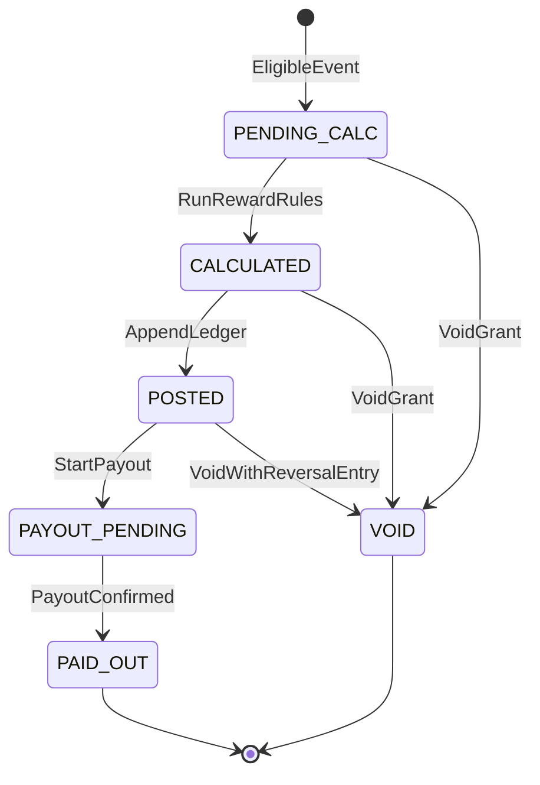
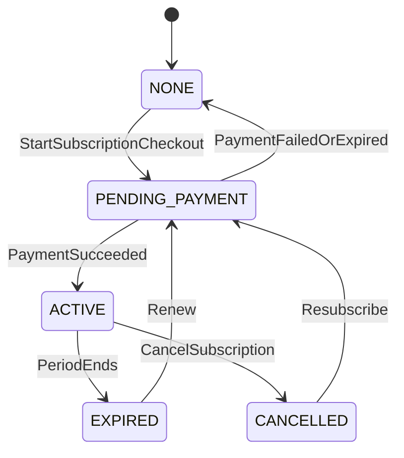

# GreenCity — State Machines

**Status:** Planning  
**Rule:** All transitions are **server-side**. Clients invoke commands; the domain validates preconditions and writes the next state. The frontend never sets status directly.

---

## 1. Marketplace: scrap submission → listing → settlement

### States

| State | Meaning |
|-------|---------|
| `SUBMITTED` | Awaiting admin |
| `UNDER_REVIEW` | Admin working |
| `REJECTED` | Admin rejected (terminal) |
| `QUOTED` | Price offered; awaiting seller |
| `QUOTE_REJECTED` | Seller rejected quote (terminal) |
| `QUOTE_EXPIRED` | Seller did not respond in time (if TTL enabled) |
| `LISTED` | Public; reservable |
| `RESERVED` | One active buyer hold |
| `AWAITING_PAYMENT` | Weight confirmed; amount fixed; waiting payment |
| `PAID` | Buyer payment succeeded (server-confirmed) |
| `SETTLED` | Commercial close complete (terminal for marketplace path) |
| `CANCELLED` | Terminal cancel |

Optional pre-submit `DRAFT` may be added later; not required for MVP if create = submit.

### Transition diagram

### Guards (high level)

| Transition | Guards |
|------------|--------|
| `IssueQuote` | Actor is admin; price ∈ category range; submission under review |
| `AcceptQuote` | Actor is seller owner; quote not expired |
| `ReserveListing` | Buyer has active subscription; listing `LISTED`; no other live hold |
| `ConfirmActualWeight` | Confirmed measure present; actor authorized (see open Q1); reservation valid |
| `PaymentSucceeded` | Only via verified provider event; amount matches locked invoice |
| `CompleteSettlement` | Payment succeeded; ops complete per policy |
| `PostSellerReward` | Side effect after `SETTLED` (or defined settle event); once per listing/order |

### Invariants

- Exactly **one** of: free to reserve (`LISTED`) or held (`RESERVED` / later payment states) for a given live listing.
- Estimate never becomes the billed amount without confirmation step.

---

## 2. Cleanup report

### States

| State | Meaning |
|-------|---------|
| `REPORTED` | New tip |
| `UNDER_REVIEW` | Admin reviewing |
| `REJECTED` | Invalid (terminal) |
| `DUPLICATE` | Linked to canonical; not independently completable for full reward |
| `VERIFIED` | Accepted; not yet assigned |
| `ASSIGNED` | Partner assigned |
| `IN_PROGRESS` | Partner working |
| `COMPLETION_SUBMITTED` | Evidence in; awaiting admin |
| `COMPLETED` | Admin verified done |
| `CANCELLED` | Terminal operational cancel |

### Transition diagram

### Guards

| Transition | Guards |
|------------|--------|
| `VerifyReport` / `MarkDuplicate` | Admin only |
| `AssignPartner` | Report `VERIFIED`; partner active |
| `SubmitCleanupEvidence` | Actor is assigned partner |
| `VerifyCleanupCompletion` | Admin only; evidence present |
| `PostReporterReward` | Report `COMPLETED`; once per canonical report |

**Partner never moves report to `COMPLETED`.** Partner only reaches `COMPLETION_SUBMITTED`.

---

## 3. Payment

Separate aggregate tied to an **Order** (and later possibly subscription checkout).

### States

| State | Meaning |
|-------|---------|
| `CREATED` | Amount computed and locked |
| `PENDING` | Awaiting user/provider action |
| `SUCCEEDED` | Provider success verified server-side |
| `FAILED` | Hard fail |
| `EXPIRED` | Checkout window ended |
| `REFUNDED` | Post-success reverse **only if** real provider + business policy support it |

### Transition diagram

### Rules

- Amount is immutable once `PENDING`/`SUCCEEDED` (MVP: recompute only before `PENDING`).
- Listing/order moves to paid/settled only on **server-confirmed** success — not client return URL alone.
- Do not invent partial capture, split payout, or escrow unless the chosen provider documents them.
- **Payment integration is blocked** until domain model + these machines are stable and a provider is selected with real docs.

### Subscription payment (same thin machine)

Subscription renewals use the same lifecycle; `BuyerSubscription.ends_at` advances only on `SUCCEEDED` (idempotent).

---

## 4. Reward

**Not** a mutable `users.balance`. Model as **RewardGrant** / **RewardLedgerEntry**.

### States (grant lifecycle)

| State | Meaning |
|-------|---------|
| `PENDING_CALC` | Eligible business event observed |
| `CALCULATED` | Amount fixed by deterministic rules |
| `POSTED` | Appended to reward ledger (source of truth) |
| `PAYOUT_PENDING` | Optional external cash-out batch |
| `PAID_OUT` | External payout done (if any) |
| `VOID` | Eligibility reversed (fraud/undo); audited |

### Transition diagram

### Ledger principles

- Append-only rows: `credit` / `debit` with `reason`, `source_type`, `source_id`, `rule_version`, `amount_vnd`.
- Available total = **sum of ledger**, never a single authoritative balance column as SoT.
- Idempotency key examples:
  - `reward:marketplace_seller:order:{orderId}`
  - `reward:cleanup_reporter:report:{reportId}`
- Ranges: seller **2,000–5,000** VND; reporter **2,000–10,000** VND (clamp via active `RewardRule`).

### Eligibility triggers (recommended)

| Domain | Trigger for PENDING_CALC |
|--------|---------------------------|
| Marketplace seller | Order/listing **SETTLED** (or explicit product decision: after PAID — open Q) |
| Cleanup reporter | Report **COMPLETED** by admin |

---

## 5. Buyer subscription (gate)

| State | Meaning |
|-------|---------|
| `NONE` | No access |
| `PENDING_PAYMENT` | Checkout started |
| `ACTIVE` | `ends_at > now` |
| `EXPIRED` | Past end |
| `CANCELLED` | Ended early |

**Reserve precondition:** exists subscription with `ACTIVE` covering `now`.  
**Recommended:** re-check at payment start; mid-flight expiry policy is open (Q6).

---

## 6. Anti-patterns (rejected)

| Rejected | Why |
|----------|-----|
| Client `PATCH { status: "COMPLETED" }` | Fraud and desync |
| UI-only disable of second Reserve button | Race without DB uniqueness |
| Partner marks report completed → auto reward | Trust boundary violation |
| Payment success from browser redirect only | Spoofable |
| Updating `users.balance` in place as ledger | No audit trail; double-grant risk |

---

## 7. Implementation notes (when building)

- Encode transitions in a single domain function per aggregate: `transition(entity, command, actor)`.
- Illegal edges → `409`/`403`/`422`; no silent success.
- Persist `from_status`, `to_status`, `actor_id`, `reason`, `request_id` in audit/event log for admin paths.
- DB partial unique indexes backstop reservation/order races (see architecture ERD).
